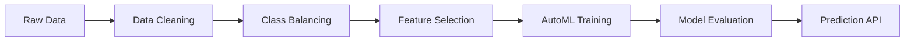

# 🏦 Automated Loan Approval/Rejection System

[](LICENSE)
[](https://www.python.org/downloads/)

A comprehensive machine learning pipeline for automated loan approval decisions, featuring advanced data preprocessing, class balancing, feature selection, and AutoML model training.

## 📋 Table of Contents
- [Features](#-features)
- [Architecture](#-architecture)
- [Installation](#-installation)
- [Usage](#-usage)
- [Project Structure](#-project-structure)
- [Configuration](#-configuration)
- [Contributing](#-contributing)
- [License](#-license)
- [Acknowledgments](#-acknowledgments)

## Overview
This project implements an end-to-end machine learning pipeline for processing and analyzing financial loan data, with a focus on automated data cleaning, feature selection, and model training. The pipeline uses advanced techniques including vector embeddings, automated data cleaning, class balancing, and AutoML for loan approval decisions.

## ✨ Features

### 🔍 Data Processing
- **Automated Data Cleaning**
  - Missing value imputation
  - Outlier detection using IQR
  - Duplicate removal
  - Data type inference
  - One-hot encoding

### ⚖️ Class Balancing
- Two-stage approach (Tomek Links + SMOTE)
- Configurable thresholds
- Automated ratio optimization

### 🎯 Feature Engineering
- Statistical feature selection
- F-scores for numerical features
- Chi-square tests for categoricals
- Metadata-driven type inference

### 🤖 AutoML Integration
- H2O AutoML for model training
- Hyperparameter optimization
- Cross-validation
- SHAP interpretability

### 🔍 Automated EDA (Exploratory Data Analysis)
- Automated generation of data insights
- Statistical analysis of features
- Visualization of data distributions
- Correlation analysis
- Missing value analysis

### 📝 Context Extraction
- Multi-model context understanding
- Integration with Google Gemini and Ollama
- Dynamic prompt handling
- Configurable model fallback system

## 🏗️ Architecture



## 🛠️ Components

### 1. Data Cleaning Agent (`data_cleaning/data_cleaning.py`)
- Automated data cleaning using metadata-driven approach
- Integrates with Pinecone for metadata storage and retrieval
- Features:
  - Missing value detection and handling
  - Outlier detection using IQR method
  - Duplicate detection and removal
  - Automated data type inference and conversion
  - One-hot encoding for categorical variables

### 2. Class Balancing Agent (`class_imbalance_handler_Agent/class_balancer_agent.py`)
- Handles class imbalance in loan approval/rejection data
- Implements a two-stage balancing approach:
  - Stage 1: Undersampling using Tomek Links
  - Stage 2: Oversampling using SMOTE
- Configurable parameters:
  - `HUGE_IMBALANCE_THRESHOLD`: 4.0
  - `TARGET_RATIO`: 1.5

### 3. Feature Selection Agent (`feature_selection/feature_selection_agent.py`)
- Statistical feature selection using:
  - F-scores for numerical features
  - Chi-square tests for categorical features
- Metadata-driven feature type inference
- Integration with Pinecone for feature metadata storage

### 4. AutoML Predictor (`AutoML/predictor_agent.py`)
- Implements H2O AutoML for model training
- Features:
  - Automated model selection
  - Hyperparameter optimization
  - Cross-validation
  - Model evaluation and interpretation

### 5. Context Extractor (`context_extractor/context_extract.py`)
- Multi-model context extraction
- Integration with Google Gemini and Ollama
- Dynamic prompt handling
- Configurable model fallback system
- Group chat functionality for collaborative analysis

### 6. EDA Automation (`eda_automation/automate_eda.py`)
- Automated exploratory data analysis
- Statistical analysis of features
- Data visualization generation
- Integration with LangChain for data frame analysis
- Fallback mechanism for model availability

### 7. Metadata Management (`scripts/`)
- `upload_to_pinecone.py`: Manages descriptive metadata
- `upload_statistical_metadata.py`: Handles statistical metadata

## Directory Structure
```
data_cleaning_agent/
├── AutoML/
│   └── predictor_agent.py
├── balanced_data/
│   └── application_train.csv
├── class_imbalance_handler_Agent/
│   └── class_balancer_agent.py
├── cleaned_csv/
│   └── cleaned_application_train.csv
├── context_extractor/
│   └── context_extract.py
├── data/
│   └── metadata.csv
├── data_cleaning/
│   └── data_cleaning.py
├── eda_automation/
│   └── automate_eda.py
├── feature_selection/
│   └── feature_selection_agent.py
├── fintech_data/
│   ├── application_test.csv
│   └── application_train.csv
├── logs/
│   ├── cleaning_logs/
│   └── class_balancing_logs/
└── scripts/
    ├── upload_statistical_metadata.py
    └── upload_to_pinecone.py
```

## 🚀 Installation

### Prerequisites
- Python 3.8 or higher
- [H2O AutoML](https://www.h2o.ai/products/h2o-automl/)
- [Pinecone](https://www.pinecone.io/) account
- [Ollama](https://ollama.ai/) installed locally
- [Git](https://git-scm.com/)

### Quick Start

1. **Clone the repository**
   ```bash
   git clone https://github.com/yourusername/automated-loan-approval.git
   cd automated-loan-approval
   ```

2. **Set up a virtual environment**
   ```bash
   python -m venv venv
   # Windows
   .\venv\Scripts\activate
   # macOS/Linux
   source venv/bin/activate
   ```

3. **Install dependencies**
   ```bash
   pip install -r requirements.txt
   ```

4. **Configure environment**
   Create a `.env` file in the root directory:
   ```env
   # Required
   PINECONE_API_KEY="your_pinecone_api_key"
   
   # Optional (with defaults)
   OLLAMA_MODEL_NAME="nomic-embed-text"
   OLLAMA_CHAT_MODEL="llama3.2:1b"
   GEMINI_API_KEY="your_gemini_api_key"
   GEMINI_API_KEY_1="your_backup_gemini_api_key"
   ```

5. **Initialize vector database**
   ```bash
   python scripts/upload_to_pinecone.py
   python scripts/upload_statistical_metadata.py
   ```

## 🛠️ Usage

### Running the Pipeline

1. **Data Cleaning**
   ```bash
   python -m data_cleaning.data_cleaning
   ```
   Outputs cleaned data to: `cleaned_csv/cleaned_application_train.csv`

2. **Class Balancing**
   ```bash
   python -m class_imbalance_handler_Agent.class_balancer_agent
   ```
   Outputs balanced data to: `balanced_data/application_train.csv`

3. **Feature Selection**
   ```bash
   python -m feature_selection.feature_selection_agent
   ```
   Saves selected features metadata

4. **Model Training**
   ```bash
   python -m AutoML.predictor_agent
   ```
   Trains and evaluates models, saving results to `AutoML/output/`

### Running the Complete Pipeline
To run the entire pipeline end-to-end:
```bash
python -m data_cleaning.data_cleaning && \
python -m class_imbalance_handler_Agent.class_balancer_agent && \
python -m feature_selection.feature_selection_agent && \
python -m AutoML.predictor_agent
```

## 🔄 Data Flow

1. **Data Ingestion**
   - Raw loan application data is loaded from `fintech_data/`
   - Expected files: `application_train.csv` and `application_test.csv`

2. **Processing Pipeline**
   - Data cleaning → `cleaned_csv/`
   - Class balancing → `balanced_data/`
   - Feature selection → `feature_selection/output/`
   - Model training → `AutoML/output/`

3. **Output Artifacts**
   - Cleaned datasets
   - Trained models
   - Evaluation metrics
   - Prediction results

## 📊 Monitoring & Logging

### Logging System
- **Location**: `logs/` directory
- **Log Types**:
  - `cleaning_logs/`: Data cleaning operations
  - `class_balancing_logs/`: Class balancing metrics
  - `model_training/`: Training metrics and parameters

### Performance Metrics
- **Classification Metrics**:
  - Accuracy, Precision, Recall, F1-Score
  - ROC-AUC and PR-AUC
  - Confusion Matrix
- **Feature Importance**:
  - SHAP values
  - Permutation importance

### Vector Database (Pinecone)
- **Indexes**:
  - `fintech-app-traintestfinal-metadata-index`: Descriptive metadata
  - `fintech-statisticalfinal-metadata-index`: Statistical metadata
- **Usage**:
  - Fast similarity search
  - Efficient metadata retrieval

## 🛡️ Error Handling & Reliability

### Error Types Handled
- Missing data files
- Invalid data formats
- API connection issues
- Resource constraints

### Recovery Mechanisms
- Automatic retries for failed operations
- Checkpointing for long-running processes
- Detailed error messages with suggested actions

## 📈 Model Performance

### Key Metrics
- **Training Performance**:
  - Cross-validated scores
  - Learning curves
  - Feature importance analysis
  
- **Validation Performance**:
  - Holdout set evaluation
  - Business metrics alignment
  - Fairness analysis across subgroups

### Monitoring Tools
- Automated logging to `logs/model_training/`
- TensorBoard integration for visualization
- Custom performance dashboards (optional)

## 👥 Contributing

We welcome contributions from the community! Here's how you can help:

1. **Report Bugs**
   - Submit bug reports and feature requests through [GitHub Issues](https://github.com/yourusername/automated-loan-approval/issues)

2. **Development**
   - Fork the repository
   - Create a feature branch (`git checkout -b feature/amazing-feature`)
   - Commit your changes (`git commit -m 'Add some amazing feature'`)
   - Push to the branch (`git push origin feature/amazing-feature`)
   - Open a Pull Request

3. **Code Style**
   - Follow [PEP 8](https://www.python.org/dev/peps/pep-0008/) guidelines
   - Include docstrings for all public functions
   - Add unit tests for new features

## 📝 License

This project is licensed under the MIT License - see the [LICENSE](LICENSE) file for details.

## 🙏 Acknowledgments

This project was made possible thanks to these amazing technologies and services:

- [H2O.ai](https://www.h2o.ai/) - For their powerful AutoML capabilities
- [Pinecone](https://www.pinecone.io/) - For efficient vector database services
- [Ollama](https://ollama.ai/) - For local LLM embeddings and chat models
- [Google Gemini](https://ai.google.dev/) - For advanced AI capabilities
- The open-source community for their invaluable contributions

## 📞 Support

For support, please [open an issue](https://github.com/yourusername/automated-loan-approval/issues) or contact the maintainers directly.

---

<div align="center">
  Made with ❤️ by [Your Name/Organization]
</div>